Predictive Modeling for Rental Bike Demand Optimization in Seoul
================
2024-04-23

``` r
knitr::opts_chunk$set(fig.width=6, fig.height=4)
```

I got this data from UC Irvine Machine Learning Repository.
(archive.ics.uci.edu/dataset/560/seoul+bike+sharing+demandSince) Seoul’s
bike sharing system runs 24 hours, each row represents the hour (0~23)
in the specific date, containing the counts of the rents and the weather
conditions of that time. In order to run the sharing bike business
without shortage, it is important to prepare a sufficient amount of
bikes. By analyzing the weather data and the rent data, we would be able
to predict the usage of the bike based on the weather conditions and be
prepared for the demand with ease. There was no information about the
pedigree of this data on UC Irvine machine learning repository website.
So, I searched the Korean search engine and found out that
<https://data.seoul.go.kr/> provides the data about Seoul bike sharing
system. In this website, hourly counts of the bike rent, which is the
same dataframe as the data I used, is also provided. Since the bike
sharing system is run by the Seoul Metropolitan Government, I’m pretty
sure that the website that I found is the right pedigree of the data.
Also, for the weather data, I found that <https://data.kma.go.kr/> ,
which is the website of the Korea Meteorological Administration,
provides the detailed weather data. Since Korea doesn’t have another
weather forecasting institution, I strongly believe that this website is
the right pedigree of the weather data.

``` r
bikedata=read.csv("C:/Users/natet/Desktop/24-SP/STA-364/SeoulBikeData.csv")
str(bikedata) #str
```

    ## 'data.frame':    8760 obs. of  14 variables:
    ##  $ Date                     : chr  "1/12/2017" "1/12/2017" "1/12/2017" "1/12/2017" ...
    ##  $ Rented.Bike.Count        : int  254 204 173 107 78 100 181 460 930 490 ...
    ##  $ Hour                     : int  0 1 2 3 4 5 6 7 8 9 ...
    ##  $ Temperature..C.          : num  -5.2 -5.5 -6 -6.2 -6 -6.4 -6.6 -7.4 -7.6 -6.5 ...
    ##  $ Humidity...              : int  37 38 39 40 36 37 35 38 37 27 ...
    ##  $ Wind.speed..m.s.         : num  2.2 0.8 1 0.9 2.3 1.5 1.3 0.9 1.1 0.5 ...
    ##  $ Visibility..10m.         : int  2000 2000 2000 2000 2000 2000 2000 2000 2000 1928 ...
    ##  $ Dew.point.temperature..C.: num  -17.6 -17.6 -17.7 -17.6 -18.6 -18.7 -19.5 -19.3 -19.8 -22.4 ...
    ##  $ Solar.Radiation..MJ.m2.  : num  0 0 0 0 0 0 0 0 0.01 0.23 ...
    ##  $ Rainfall.mm.             : num  0 0 0 0 0 0 0 0 0 0 ...
    ##  $ Snowfall..cm.            : num  0 0 0 0 0 0 0 0 0 0 ...
    ##  $ Seasons                  : chr  "Winter" "Winter" "Winter" "Winter" ...
    ##  $ Holiday                  : chr  "No Holiday" "No Holiday" "No Holiday" "No Holiday" ...
    ##  $ Functioning.Day          : chr  "Yes" "Yes" "Yes" "Yes" ...

We got Date column, Rented bike count column, which counts the number of
rents in each hour, and several weather conditions columns. Season
stands for the season of the date and holiday is ‘holiday’ if the date
is a holiday.

``` r
bikedata$Date = as.Date(bikedata$Date, "%d/%m/%Y") #Convert Date column as Date
# Convert a character as a factor
bikedata$Seasons = as.factor(bikedata$Seasons)
bikedata$Holiday = as.factor(bikedata$Holiday)
bikedata$Functioning.Day = as.factor(bikedata$Functioning.Day)
summary(bikedata) #Summary
```

    ##       Date            Rented.Bike.Count      Hour       Temperature..C. 
    ##  Min.   :2017-12-01   Min.   :   0.0    Min.   : 0.00   Min.   :-17.80  
    ##  1st Qu.:2018-03-02   1st Qu.: 191.0    1st Qu.: 5.75   1st Qu.:  3.50  
    ##  Median :2018-06-01   Median : 504.5    Median :11.50   Median : 13.70  
    ##  Mean   :2018-06-01   Mean   : 704.6    Mean   :11.50   Mean   : 12.88  
    ##  3rd Qu.:2018-08-31   3rd Qu.:1065.2    3rd Qu.:17.25   3rd Qu.: 22.50  
    ##  Max.   :2018-11-30   Max.   :3556.0    Max.   :23.00   Max.   : 39.40  
    ##   Humidity...    Wind.speed..m.s. Visibility..10m. Dew.point.temperature..C.
    ##  Min.   : 0.00   Min.   :0.000    Min.   :  27     Min.   :-30.600          
    ##  1st Qu.:42.00   1st Qu.:0.900    1st Qu.: 940     1st Qu.: -4.700          
    ##  Median :57.00   Median :1.500    Median :1698     Median :  5.100          
    ##  Mean   :58.23   Mean   :1.725    Mean   :1437     Mean   :  4.074          
    ##  3rd Qu.:74.00   3rd Qu.:2.300    3rd Qu.:2000     3rd Qu.: 14.800          
    ##  Max.   :98.00   Max.   :7.400    Max.   :2000     Max.   : 27.200          
    ##  Solar.Radiation..MJ.m2.  Rainfall.mm.     Snowfall..cm.       Seasons    
    ##  Min.   :0.0000          Min.   : 0.0000   Min.   :0.00000   Autumn:2184  
    ##  1st Qu.:0.0000          1st Qu.: 0.0000   1st Qu.:0.00000   Spring:2208  
    ##  Median :0.0100          Median : 0.0000   Median :0.00000   Summer:2208  
    ##  Mean   :0.5691          Mean   : 0.1487   Mean   :0.07507   Winter:2160  
    ##  3rd Qu.:0.9300          3rd Qu.: 0.0000   3rd Qu.:0.00000                
    ##  Max.   :3.5200          Max.   :35.0000   Max.   :8.80000                
    ##        Holiday     Functioning.Day
    ##  Holiday   : 432   No : 295       
    ##  No Holiday:8328   Yes:8465       
    ##                                   
    ##                                   
    ##                                   
    ## 

Time period of the data is from 12/1/2017 to 11/30/2018. Weather
conditions are hard to interpret since Korea has four seasons. Holidays
were much lesser than Normal days and there were 295 non-functioning day
among there time periods.

``` r
# Check the missing value
missing_values = is.na(bikedata)
table(missing_values)
```

    ## missing_values
    ##  FALSE 
    ## 122640

There is no missing value in the dataset.

``` r
# Define threshold for outliers
threshold = 3 * sd(bikedata$Rented.Bike.Count)

# Identify outliers
outliers = bikedata$Rented.Bike.Count[abs(bikedata$Rented.Bike.Count - mean(bikedata$Rented.Bike.Count)) > threshold]

# Numbers of outliers
length(outliers)
```

    ## [1] 67

``` r
# Make plots of several x variables and Rent Counts
plot(bikedata$Hour, bikedata$Rented.Bike.Count, main="Hour Versus Rent Counts", xlab = "Hour(Time)", ylab = "Rent Counts")
```

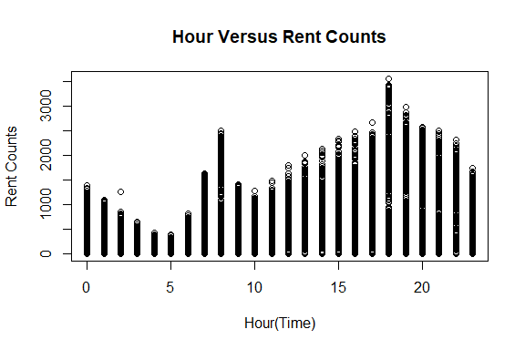<!-- --> In this plot,
before noon, there is a sharp increase from 5am to 8am, and then it
drops. After noon, rent counts keep increasing and peaks at 6pm, and
then decrease. By this result, we can guess that the main purpose of the
sharing bike is commuting.

``` r
plot(bikedata$Temperature..C., bikedata$Rented.Bike.Count, main="Temperature Versus Rent Counts", xlab = "Temperature(°C)", ylab = "Rent Counts")
```

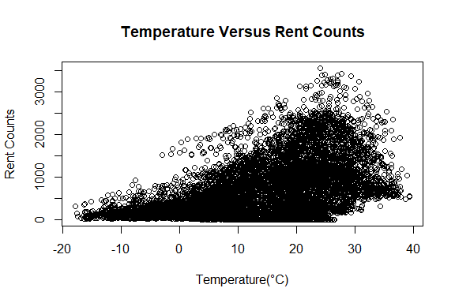<!-- --> This plot shows
that until about 25 degrees, rent counts increse as the temperature goes
up. However, when temperature rises too high above 25 degrees, rent
counts decreases sharply.

``` r
plot(bikedata$Humidity..., bikedata$Rented.Bike.Count, main="Humidity Versus Rent Counts", xlab = "Humidity(%)", ylab = "Rent Counts")
```

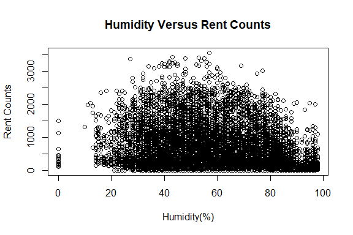<!-- --> This plot shows
the relationship between rent counts and humidity. Rent counts increase
until humidity rises around 50%, but it decreases after 50%.

``` r
plot(bikedata$Dew.point.temperature..C., bikedata$Rented.Bike.Count, main="Dew Point Temperature Versus Rent Counts", xlab = "Dew Point Temperature(°C)", ylab = "Rent Counts")
```

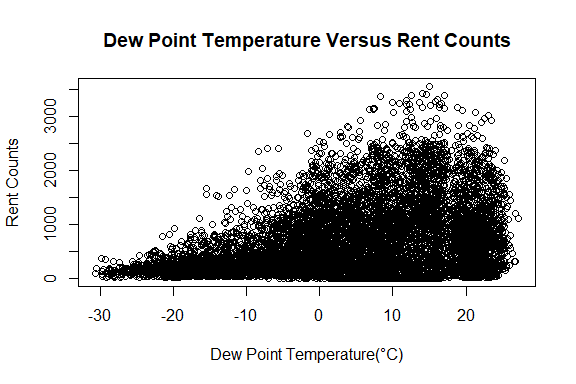<!-- --> Overall, there
is also a positive relationship between dew point temperature and the
rent counts. However, rent counts decrease when the temperature is too
high.

``` r
plot(bikedata$Rainfall.mm., bikedata$Rented.Bike.Count, main="Rainfall Versus Rent Counts", xlab = "Rainfall", ylab = "Rent Counts")
```

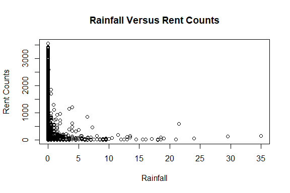<!-- -->

``` r
plot(bikedata$Snowfall..cm., bikedata$Rented.Bike.Count, main="Snowfall Versus Rent Counts", xlab = "Snowfall", ylab = "Rent Counts")
```

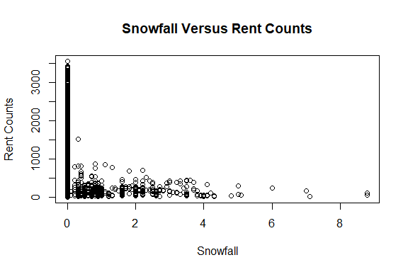<!-- --> Those graphs
show the negative relationship between rent counts and precipitation. It
is obvious that snowfall plot decreases more sharply than rainfall plot.
This means that customers are more prone to snow than rain.

``` r
seasons_n  = factor(bikedata$Seasons, levels=c("Spring", "Summer", "Autumn", "Winter"))
plot(seasons_n, bikedata$Rented.Bike.Count, main="Seasons Versus Rent Counts", xlab = "Seasons", ylab = "Rent Counts")
```

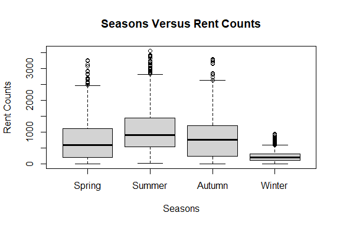<!-- --> According to
this graph, it is obvious that rent counts go up in summer and pretty
similar in spring and autumn. Also, tent counts are relatively low in
winter.

``` r
plot(bikedata$Holiday, bikedata$Rented.Bike.Count, main="Holiday Versus Rent Counts", xlab = "Holiday", ylab = "Rent Counts")
```

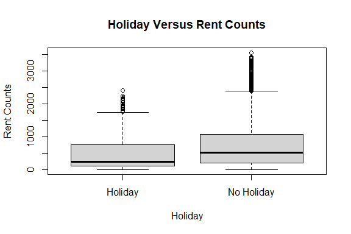<!-- --> This graph
tells us that rent counts in ‘no holiday’ is slightly higher than the
one in holiday. By this result, we can assume that the primary use of
the sharing bike is for commuting rather than leisure.

``` r
plot(bikedata$Date, bikedata$Rented.Bike.Count, main="Date Versus Rent Counts", xlab = "Date", ylab = "Rent Counts")
```

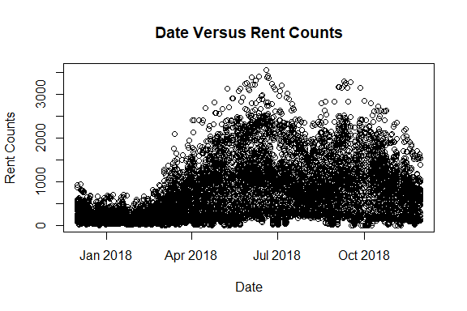<!-- --> This plot also
shows the relation between the seasons and the rent counts. Until around
July, as time goes by, rent counts also increase. Also, there is a
little amount of decrease between July and September. This might be a
result of the high temperature and humidity of the late summer in Korea.

I gathered variables that don’t really have a clear relationship with
rent counts and applied log for the each one.

``` r
plot(bikedata$Wind.speed..m.s., bikedata$Rented.Bike.Count, main="Wind Speed Versus Rent Counts", xlab = "Wind Speed", ylab = "Rent Counts")
```

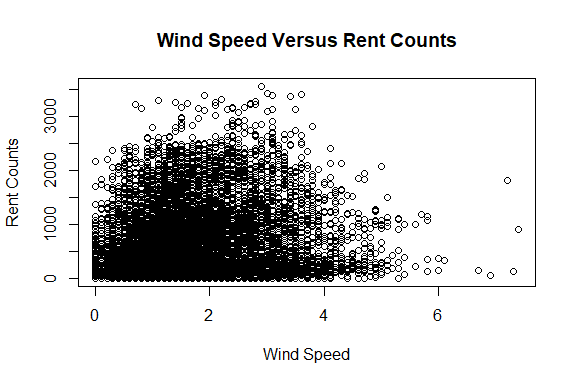<!-- -->

``` r
plot(bikedata$Wind.speed..m.s., log(bikedata$Rented.Bike.Count), main="Wind Speed Versus Rent Counts", xlab = "Wind Speed", ylab = "Rent Counts(Log)")
```

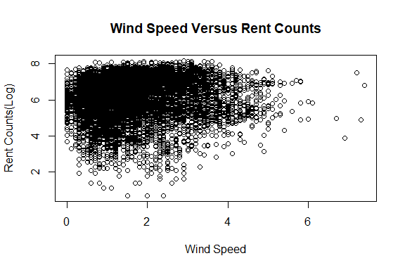<!-- -->

``` r
plot(log(bikedata$Wind.speed..m.s.), bikedata$Rented.Bike.Count, main="Wind Speed Versus Rent Counts", xlab = "Wind Speed(Log)", ylab = "Rent Counts")
```

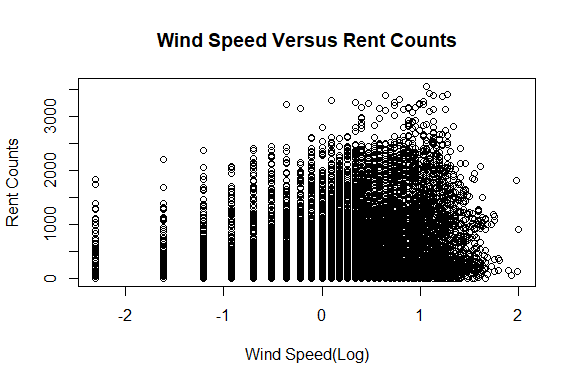<!-- --> Even though I
logged both variables, it was hard to find the obvious correlation
between wind speed and rent counts. This means that wind speed is not a
critical determinant of the data.

``` r
plot(bikedata$Visibility..10m., bikedata$Rented.Bike.Count, main="Visibility Versus Rent Counts", xlab = "Visibility", ylab = "Rent Counts")
```

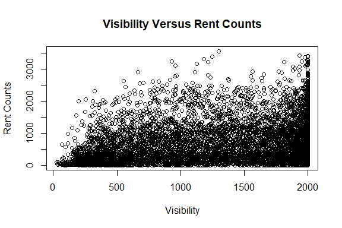<!-- -->

``` r
plot(log(bikedata$Visibility..10m.), bikedata$Rented.Bike.Count, main="Visibility Versus Rent Counts", xlab = "Visibility(Log)", ylab = "Rent Counts")
```

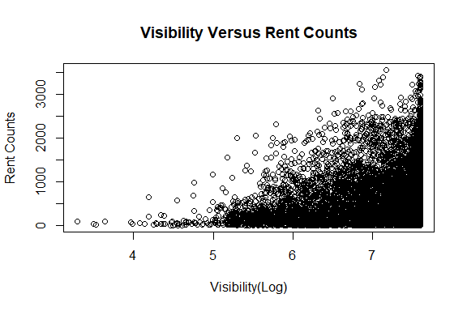<!-- --> This time, I
logged on visibility to clarify the relationship between two variables.
As you can see in the second graph, there is a positive relationship
between visibility and the rent counts.

``` r
plot(bikedata$Solar.Radiation..MJ.m2., bikedata$Rented.Bike.Count, main="Solar Radiation Versus Rent Counts", xlab = "Solar Radiation", ylab = "Rent Counts")
```

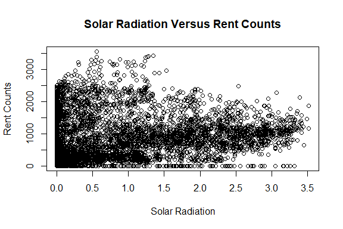<!-- -->

``` r
plot(bikedata$Solar.Radiation..MJ.m2., log(bikedata$Rented.Bike.Count), main="Solar Radiation Versus Rent Counts", xlab = "Solar Radiation", ylab = "Rent Counts")
```

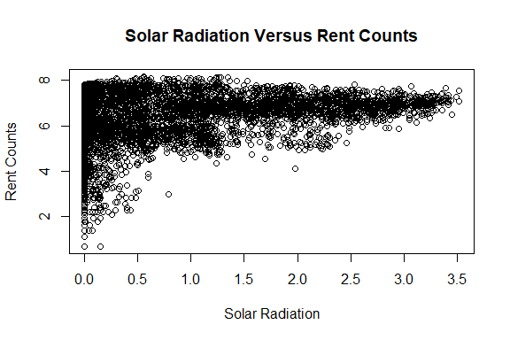<!-- --> For this
graph, I logged on the rent counts. There is also a positive
relationship between solar radiation and rent counts, in general.

``` r
# Cut the continuous y variable into 'low' and 'high'
cutpoints = c(min(bikedata$Rented.Bike.Count) - 1, median(bikedata$Rented.Bike.Count), max(bikedata$Rented.Bike.Count))
bikedata$Rentscat = cut(bikedata$Rented.Bike.Count, breaks = cutpoints, labels = c('Low', 'High'))
# Check the missing values
missing_values = is.na(bikedata$Rented.Bike.Count)
table(missing_values)
```

    ## missing_values
    ## FALSE 
    ##  8760

``` r
library(class) #contains knn function
library(tidyverse) #contains dpyr and other packages
```

    ## ── Attaching core tidyverse packages ──────────────────────── tidyverse 2.0.0 ──
    ## ✔ dplyr     1.1.4     ✔ readr     2.1.5
    ## ✔ forcats   1.0.0     ✔ stringr   1.5.1
    ## ✔ ggplot2   3.5.0     ✔ tibble    3.2.1
    ## ✔ lubridate 1.9.3     ✔ tidyr     1.3.1
    ## ✔ purrr     1.0.2     
    ## ── Conflicts ────────────────────────────────────────── tidyverse_conflicts() ──
    ## ✖ dplyr::filter() masks stats::filter()
    ## ✖ dplyr::lag()    masks stats::lag()
    ## ℹ Use the conflicted package (<http://conflicted.r-lib.org/>) to force all conflicts to become errors

``` r
# make factors into numeric values
bikedata$Seasons = ordered(bikedata$Seasons, levels = c("Spring", "Summer", "Autumn", "Winter"))
bikedata$Seasons = as.numeric(bikedata$Seasons)
bikedata$Holiday = as.numeric(bikedata$Holiday)
bikedata$Functioning.Day = as.numeric(bikedata$Functioning.Day)

# define the function of zscores
z_scores = function(x) {
  return ((x - mean(x)) / sd(x))
}
# Use Zscores function into bikedata and assign a new dataframe
bikedata_n = as.data.frame(lapply(bikedata[,3:13], FUN=z_scores))

Rent = bikedata$Rentscat # creates a separate vector called "Rent"
bikedata_n=cbind(Rent, bikedata_n) # overwrite bikedata_n and combine rent vector
str(bikedata_n)
```

    ## 'data.frame':    8760 obs. of  12 variables:
    ##  $ Rent                     : Factor w/ 2 levels "Low","High": 1 1 1 1 1 1 1 1 2 1 ...
    ##  $ Hour                     : num  -1.66 -1.52 -1.37 -1.23 -1.08 ...
    ##  $ Temperature..C.          : num  -1.51 -1.54 -1.58 -1.6 -1.58 ...
    ##  $ Humidity...              : num  -1.042 -0.993 -0.944 -0.895 -1.092 ...
    ##  $ Wind.speed..m.s.         : num  0.458 -0.893 -0.7 -0.796 0.555 ...
    ##  $ Visibility..10m.         : num  0.926 0.926 0.926 0.926 0.926 ...
    ##  $ Dew.point.temperature..C.: num  -1.66 -1.66 -1.67 -1.66 -1.74 ...
    ##  $ Solar.Radiation..MJ.m2.  : num  -0.655 -0.655 -0.655 -0.655 -0.655 ...
    ##  $ Rainfall.mm.             : num  -0.132 -0.132 -0.132 -0.132 -0.132 ...
    ##  $ Snowfall..cm.            : num  -0.172 -0.172 -0.172 -0.172 -0.172 ...
    ##  $ Seasons                  : num  1.35 1.35 1.35 1.35 1.35 ...
    ##  $ Holiday                  : num  0.228 0.228 0.228 0.228 0.228 ...

``` r
# Create a random sample
oursample = sample(nrow(bikedata),floor(nrow(bikedata)*0.8)) # floor rounds down
head(oursample)
```

    ## [1] 2899 5717 4586 1573 6812 2414

``` r
# Create a train sample and a test sample
train = bikedata_n[oursample,]
test = bikedata_n[-oursample,]

# Check the proportion between the train set and the test set
prop.table(table(train$Rent)) ; prop.table(table(test$Rent))
```

    ## 
    ##       Low      High 
    ## 0.4988584 0.5011416

    ## 
    ##       Low      High 
    ## 0.5045662 0.4954338

``` r
# Assign the columns to use on the knn model
train_knn = train[,2:11] 
test_knn = test[,2:11]
```

``` r
# Execute a k-NN model, k = sqrt(1752)
knnpred = knn(train_knn, test_knn, train$Rent, k = 42, prob = TRUE) 
summary(knnpred)
```

    ##  Low High 
    ##  909  843

``` r
Proportions = attr(knnpred, "prob")
summary(Proportions)
```

    ##    Min. 1st Qu.  Median    Mean 3rd Qu.    Max. 
    ##  0.5000  0.7381  0.9048  0.8473  0.9762  1.0000

``` r
# Make a crosstable
library(gmodels) #contains CrossTable function
CrossTable(x = test$Rent, y = knnpred, prop.chisq = FALSE)
```

    ## 
    ##  
    ##    Cell Contents
    ## |-------------------------|
    ## |                       N |
    ## |           N / Row Total |
    ## |           N / Col Total |
    ## |         N / Table Total |
    ## |-------------------------|
    ## 
    ##  
    ## Total Observations in Table:  1752 
    ## 
    ##  
    ##              | knnpred 
    ##    test$Rent |       Low |      High | Row Total | 
    ## -------------|-----------|-----------|-----------|
    ##          Low |       764 |       120 |       884 | 
    ##              |     0.864 |     0.136 |     0.505 | 
    ##              |     0.840 |     0.142 |           | 
    ##              |     0.436 |     0.068 |           | 
    ## -------------|-----------|-----------|-----------|
    ##         High |       145 |       723 |       868 | 
    ##              |     0.167 |     0.833 |     0.495 | 
    ##              |     0.160 |     0.858 |           | 
    ##              |     0.083 |     0.413 |           | 
    ## -------------|-----------|-----------|-----------|
    ## Column Total |       909 |       843 |      1752 | 
    ##              |     0.519 |     0.481 |           | 
    ## -------------|-----------|-----------|-----------|
    ## 
    ## 

``` r
# Execute a k-NN model, k = 21
knnpred_low = knn(train_knn, test_knn, train$Rent, k = 21, prob = TRUE) 
summary(knnpred_low)
```

    ##  Low High 
    ##  904  848

``` r
Proportions = attr(knnpred_low, "prob")
summary(Proportions)
```

    ##    Min. 1st Qu.  Median    Mean 3rd Qu.    Max. 
    ##  0.5238  0.7619  0.9048  0.8613  1.0000  1.0000

``` r
# Make a crosstable
library(gmodels) #contains CrossTable function
CrossTable(x = test$Rent, y = knnpred_low, prop.chisq = FALSE)
```

    ## 
    ##  
    ##    Cell Contents
    ## |-------------------------|
    ## |                       N |
    ## |           N / Row Total |
    ## |           N / Col Total |
    ## |         N / Table Total |
    ## |-------------------------|
    ## 
    ##  
    ## Total Observations in Table:  1752 
    ## 
    ##  
    ##              | knnpred_low 
    ##    test$Rent |       Low |      High | Row Total | 
    ## -------------|-----------|-----------|-----------|
    ##          Low |       767 |       117 |       884 | 
    ##              |     0.868 |     0.132 |     0.505 | 
    ##              |     0.848 |     0.138 |           | 
    ##              |     0.438 |     0.067 |           | 
    ## -------------|-----------|-----------|-----------|
    ##         High |       137 |       731 |       868 | 
    ##              |     0.158 |     0.842 |     0.495 | 
    ##              |     0.152 |     0.862 |           | 
    ##              |     0.078 |     0.417 |           | 
    ## -------------|-----------|-----------|-----------|
    ## Column Total |       904 |       848 |      1752 | 
    ##              |     0.516 |     0.484 |           | 
    ## -------------|-----------|-----------|-----------|
    ## 
    ## 

``` r
# Execute a k-NN model, k = 175 (1752/10)
knnpred_high = knn(train_knn, test_knn, train$Rent, k = 175, prob = TRUE)
summary(knnpred_high)
```

    ##  Low High 
    ##  912  840

``` r
Proportions = attr(knnpred_high, "prob")
summary(Proportions)
```

    ##    Min. 1st Qu.  Median    Mean 3rd Qu.    Max. 
    ##  0.5000  0.6984  0.8571  0.8123  0.9429  1.0000

``` r
# Make a crosstable
library(gmodels) #contains CrossTable function
CrossTable(x = test$Rent, y = knnpred_high, prop.chisq = FALSE)
```

    ## 
    ##  
    ##    Cell Contents
    ## |-------------------------|
    ## |                       N |
    ## |           N / Row Total |
    ## |           N / Col Total |
    ## |         N / Table Total |
    ## |-------------------------|
    ## 
    ##  
    ## Total Observations in Table:  1752 
    ## 
    ##  
    ##              | knnpred_high 
    ##    test$Rent |       Low |      High | Row Total | 
    ## -------------|-----------|-----------|-----------|
    ##          Low |       747 |       137 |       884 | 
    ##              |     0.845 |     0.155 |     0.505 | 
    ##              |     0.819 |     0.163 |           | 
    ##              |     0.426 |     0.078 |           | 
    ## -------------|-----------|-----------|-----------|
    ##         High |       165 |       703 |       868 | 
    ##              |     0.190 |     0.810 |     0.495 | 
    ##              |     0.181 |     0.837 |           | 
    ##              |     0.094 |     0.401 |           | 
    ## -------------|-----------|-----------|-----------|
    ## Column Total |       912 |       840 |      1752 | 
    ##              |     0.521 |     0.479 |           | 
    ## -------------|-----------|-----------|-----------|
    ## 
    ## 
